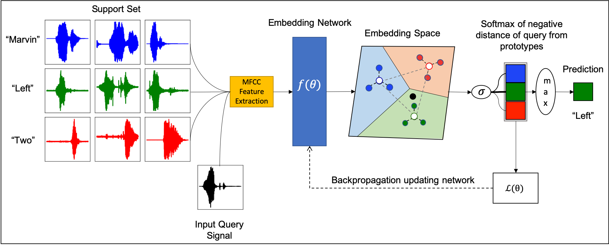
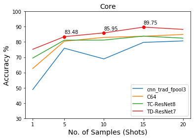
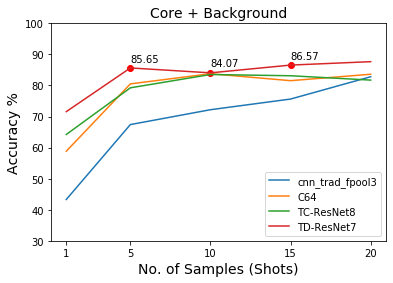
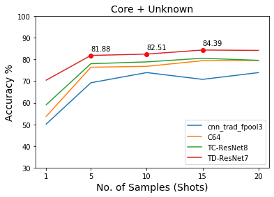
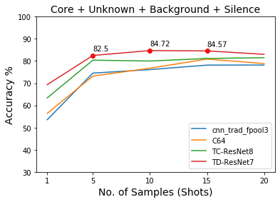

Code Repository for the paper [Few-Shot Keyword Spotting with Prototypical Networks](https://arxiv.org/abs/2007.14463).




# Installation

1. Clone the repository:  

    ```
    git clone git@github.com:deadsmash07/Few-Shot-KWS.git 
    ``` 

2.  Create a conda environment:

    ```
    conda create -n FS-KWS python=3.10
    conda activate FS-KWS
    ```

3.  If pip not installed, install pip by:

    ```
    conda install pip 
    ```

4.  Install the required packages:

    ```
    pip install -r requirements.txt
    ```

5.  Install the protonets package:

    ```
    cd Few-Shot-KWS
    python setup.py develop
    ```

# Download & Prepare Few-Shot Keyword Spotting Dataset

```
cd Few-Shot-KWS/data/
python download_prepare_data.py
```
# Train

To train a simple 2-way 1-shot experiment.

```
cd Few-Shot-KWS/scripts/train/few-shot/fewshotspeech
./train.sh 2 1 0 mymodel
```
Specify arguments to train.sh in the following manner

train.sh num_ways num_shots exp_type exp_id

- num_ways  
    + Number of classes
    + Eg. 2 or 4
- num_shots
    + Number of samples per class.
    + Eg. 1,5
- exp_type
    + Number indicating the type of experimental setup
        - 0 = Simple N-Way K-Shot Setup. No background, silence or unknown keywords.
        - 1 = Include Background
        - 2 = Include Silence
        - 3 = Include Unknown 
        - 4 = Background + Silence 
        - 5 = Background + Unkown
        - 6 = Unknown + Silence
        - 7 = Background + Silence + Unknown
- exp_id
    + identifier = directory name
    + results are saved in `Few-Shot-KWS/scripts/train/few-shot/fewshotspeech/results/[exp_id]`


# Evaluate

```
cd Few-Shot-KWS/scripts/predict/few-shot
python eval_results.py ../../train/few_shot/fewshotspeech/results/
```

The evaluation can be found in:  
```
cat Few-Shot-KWS/scripts/train/few-shot/fewshotspeech/results/[exp-id]/[timestamp]/eval.txt
```

# Results

Comaring test accuracy of different embedding networks on 4-way FS-KWS as we increase the number of support examples. The results are presented for four different cases discussed in the paper.

 

 


# References

The code in this repository has been adapted from:

1. https://github.com/jakesnell/prototypical-networks
2. https://github.com/hyperconnect/TC-ResNet
3. https://github.com/tensorflow/docs/blob/master/site/en/r1/tutorials/sequences/audio_recognition.md

# Using docker
### **Updated README.md**

#### **Installation using Docker**

1. **Install Docker**  
   Ensure you have Docker installed. You can download it from [Docker's official site](https://www.docker.com/).

2. **Build the Docker Image**  
   Run the following command in the terminal where your `Dockerfile` is located:
   ```bash
   docker build -t few-shot-kws .
    ```

3.  **Run the Docker Container**  
    Run the following command to start the container:
    ```bash
    docker run -it --name fs-kws-container few-shot-kws
    ```

4. **Access the Container and run scripts**  
    - once inside the container:
    ```bash
    cd Few-Shot-KWS/data/
    python download_prepare_data.py
    ```
    - To train a simple 2-way 1-shot experiment.
    ```bash
    cd Few-Shot-KWS/scripts/train/few-shot/fewshotspeech
    ./train.sh 2 1 0 mymodel
    ```
    - Evaluate the results
    ```bash
    cd Few-Shot-KWS/scripts/predict/few-shot
    python eval_results.py ../../train/few-shot/fewshotspeech/results/
    ```

5. **Updating and Restarting the Container**

    - To stop the container:
    ```bash
    docker stop fs-kws-container
    ```
    - to start the container again:
    ```bash
    docker start -ai fs-kws-container
    ```
    - If the codebase changes, rebuild the Docker image:
    ```bash
    docker build --no-cache -t few-shot-kws .
    ```
    

